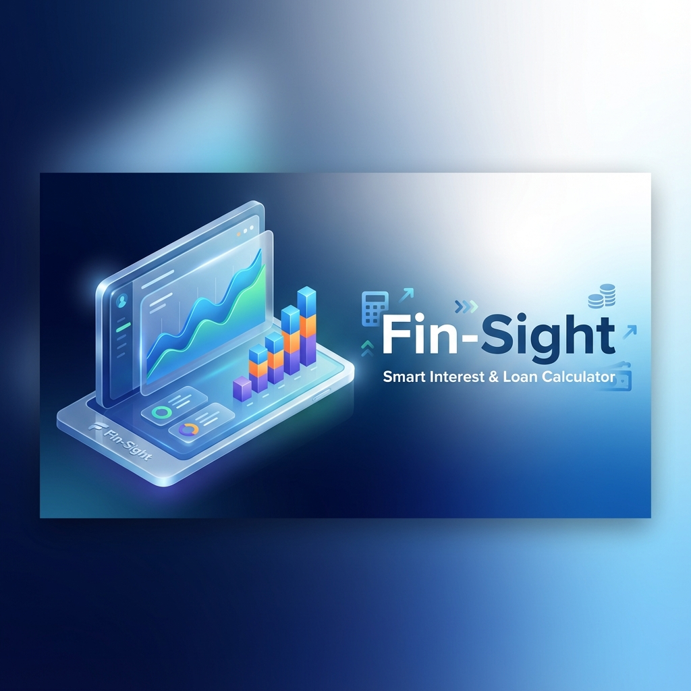

# Fin-Sight (핀사이트)



> **당신의 금융을 꿰뚫어보다. 스마트한 예적금/대출 이자 계산기**  
> Fin-Sight는 복잡한 금융 계산을 직관적인 UI와 시각화된 차트로 제공하여, 사용자의 현명한 자산 관리를 돕는 웹 애플리케이션입니다.

<div align="center">

[](https://reactjs.org/)
[](https://vitejs.dev/)
[](https://tailwindcss.com/)
[](https://firebase.google.com/)
[](https://creativecommons.org/licenses/by-nc/4.0/)

</div>

---

## ✨ Features (주요 기능)

### 💰 1. 예적금 계산기 (Savings Calculator)
- **다양한 적립 방식**: 월 적립식(적금)과 거치식(예금)을 모두 지원합니다.
- **이자 계산 옵션**: 단리/복리 방식과 과세/비과세/세금우대율을 선택하여 정확한 세후 수령액을 계산합니다.
- **자산 추이 시각화**: 시간이 지남에 따라 원금과 이자가 어떻게 불어나는지 `Area Chart`로 한눈에 보여줍니다.

### 🏦 2. 대출 계산기 (Loan Calculator)
- **상환 방식 비교**: 원리금균등, 원금균등, 만기일시상환 방식을 지원합니다.
- **거치 기간 설정**: 이자만 납부하는 거치 기간을 포함한 계산이 가능합니다.
- **상세 스케줄**: 월별 납부금, 납입 원금, 이자, 잔액을 `Data Table`로 제공합니다.

### 📊 3. 사용자 편의 기능
- **리포트 저장**: 시뮬레이션 결과를 고화질 이미지(`.png`)로 즉시 다운로드하여 소장하거나 공유할 수 있습니다.
- **금융 가이드**: 초보자를 위한 금융 상식(단리/복리 차이, 세금 혜택 등) 콘텐츠를 제공합니다.
- **반응형 디자인**: 데스크탑, 태블릿, 모바일 등 모든 디바이스에서 최적화된 화면을 제공합니다.

---

## 🛠 Tech Stack (기술 스택)

| Category | Technology |
|----------|------------|
| **Framework** |   |
| **Styling** |  |
| **Charts** |  |
| **Deployment** |  |
| **Utils** | `html2canvas` (Image Export), `lucide-react` (Icons) |

---

## 🚀 Getting Started (시작하기)

### Prerequisites
- Node.js (v18.0.0 or higher)
- npm or yarn

### Installation
```bash
# Repository Clone
git clone https://github.com/your-username/interest-calc.git

# Install Dependencies
npm install
```

### Development
```bash
# Start Development Server
npm run dev
```

### Build & Deploy
Firebase Hosting을 통해 배포됩니다.
```bash
# Build Production Bundle
npm run build

# Deploy to Firebase
npm run deploy
```

---

## 📝 License (라이선스)

**Copyright © 2025 Fin-Sight. All Rights Reserved.**

이 프로젝트의 소스 코드는 학습 및 포트폴리오 목적으로 공개되었으나, **상업적 이용은 엄격히 금지됩니다.**
(This project is for educational purposes only. Commercial use is strictly prohibited.)

- ❌ **Commercial Use**: Not Allowed (영리 목적의 사용 불가)
- ✅ **Personal Use**: Allowed (개인 학습 목적 사용 가능)
- ❌ **Redistribution**: Not Allowed without permission (무단 재배포 금지)
